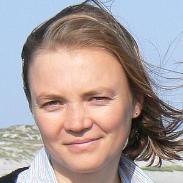

## Keynote Speaker

[Natalia Grabar](http://natalia.grabar.free.fr/), CNRS Researcher, Université de Lille

Bio (fr)

Dr. Natalia Grabar est chercheuse en Traitement Automatique des Langues (TAL), spécialisée dans l’analyse des textes scientifiques et techniques. Elle est actuellement Chargée de Recherche (classe 1) au CNRS, affiliée à l’UMR 8163 STL de l’Université de Lille. Elle est titulaire d’un doctorat en Informatique Médicale de l’Université Paris 6 et d’une formation en Philologie de l’Université de Lviv, en Ukraine. Ses recherches portent sur la structuration terminologique, la recherche et l’extraction d’informations, la typologie des documents, ainsi que la qualité et la fiabilité des informations en santé. Dr. Grabar a travaillé dans plusieurs environnements de recherche et académiques. Elle a passé un an à la fondation Health on the Net à Genève, où elle a contribué à des travaux sur l’accessibilité de l’information en santé. Elle a ensuite occupé, pendant trois ans, un poste d’Assistante Hospitalo-Universitaire (AHU) à l’Hôpital Européen Georges Pompidou et dans une unité d’informatique médicale à l’Inserm. Elle a également encadré 38 mémoires de Master et thèses de doctorat. Ses travaux mobilisent des méthodes linguistiques et statistiques pour faciliter l’accès à l’information par le TAL, notamment en recherche d’information, extraction d’information et simplification textuelle. Ses recherches contribuent au développement de méthodes et d’outils pour le traitement des langues de spécialité, avec des applications en santé et dans d’autres domaines techniques.

Bio (en)

Dr. Natalia Grabar is a researcher in Natural Language Processing (NLP), specializing in scientific and technical texts. She is currently a Chargée de Recherche (Class 1) at the CNRS, affiliated with the UMR 8163 STL at the University of Lille. She holds a PhD in Medical Informatics from Université Paris 6 and has a background in Philology from Lviv University, Ukraine. Her research focuses on terminology structuring, information retrieval and extraction, document typology, and the quality and reliability of health-related information. Dr. Grabar has worked in various research and academic settings. She spent a year at the Health on the Net foundation in Geneva, contributing to studies on health information accessibility. She then worked for three years as an Assistant Hospitalo-Universitaire (AHU) at Hôpital Européen Georges Pompidou and in a medical informatics unit at Inserm. She has also supervised 38 Master’s theses and PhD dissertations. Her work applies linguistic and statistical methods to improve access to information through NLP, particularly in information retrieval, information extraction, and text simplification. Her research contributes to the development of methods and tools for processing specialized language, with applications in healthcare and other technical fields.

### Abstract

_TBA_