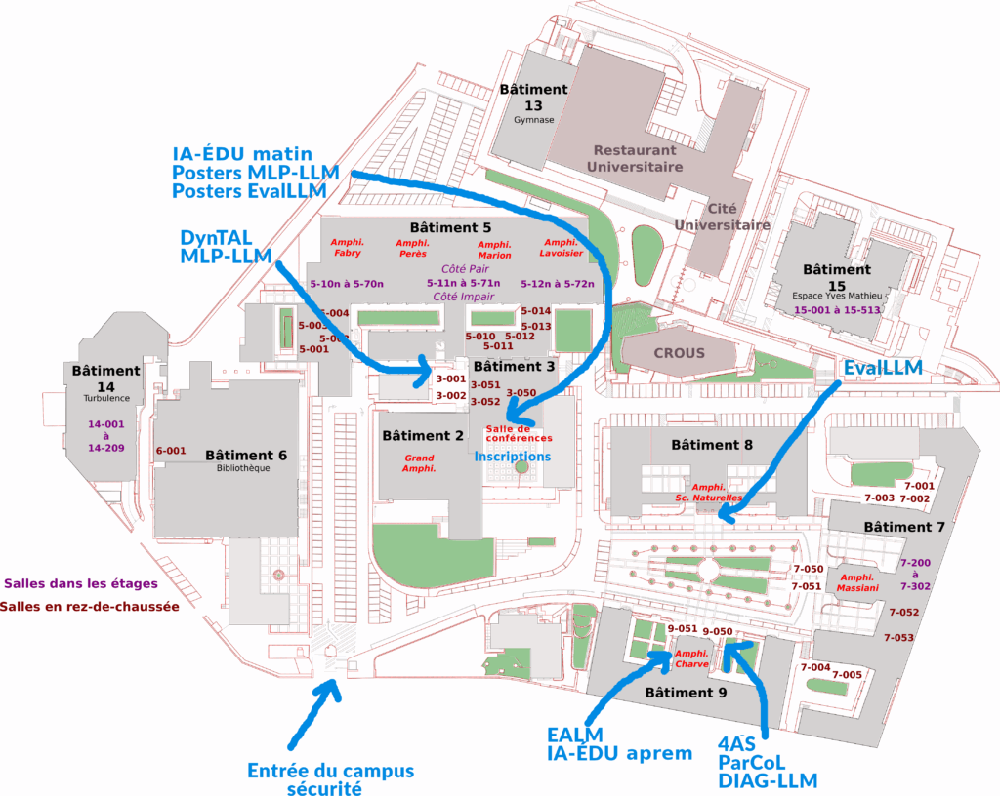

## Participants Info

### Venue

The conference will be held on the Saint-Charles campus of Aix-Marseille University. This site is located right next to Marseille's main train station, in the heart of the city.

[[See on Google Maps](https://maps.app.goo.gl/YEp3XxWAfjk1WKKBA)]

### Inside the campus

### Hotels & Things to do in Marseille

Checkout [[Practical Info](https://coria-taln-2025.lis-lab.fr/informations-pratiques/)]

### Any other questions?

Contact us: 

Aman Sinha (aman.sinha@univ-lorraine.fr) \
Ioana Buhnila (ioana.buhnila@univ-lorraine.fr)
